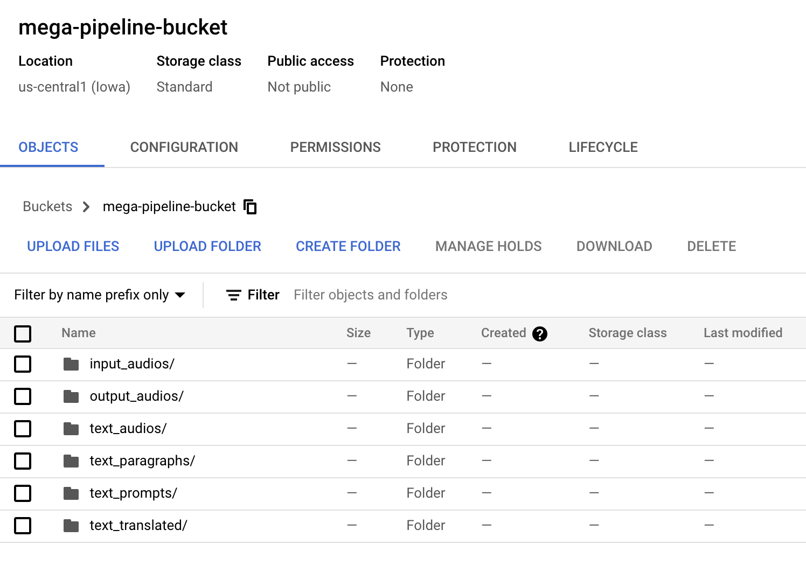

Title: Lecture 12: Virtual Environments & Virtual Machines, Containerization & Docker
Category: lectures
Date: 2021-09-21
Author: Pavlos Protopapas
Slug: lecture6
Tags: Virtual Machines, Virtual Environments

## Slides

- [Environments| PDF]({attach}presentation/lecture12.pdf) 

- [Containers| PDF]({attach}presentation/lecture13.pdf) 

- [Containers 2 | PDF]({attach}presentation/lecture14.pdf) 

 

## Tutorial - Mega Pipeline App
🎙️ → 📝 → 🗒️  → [🔊🇫🇷] → 🔊

In this tutorial the entire class will participate to build a [Mega  Pipeline App](https://ac215-mega-pipeline.dlops.io/) which does the following:

1. Allows a user to Record audio using a mic
2. The audio file is then transcribed using Google Cloud Speech to Text API
3. The text is used as a prompt to a pre-trained GPT2 model to Generate Text (100 words)
4. The generated text is synthesized to audio using Google Cloud Text-to-Speech API
5. The generated text is also translated to French using googletrans
6. The translated text is then synthesized to audio using Google Cloud Text-to-Speech API

The class will work in teams:

&nbsp;&nbsp;&nbsp;&nbsp;&nbsp;&nbsp;📝Team A [transcribe_audio](https://github.com/dlops-io/mega-pipeline/tree/main/transcribe_audio): 

&nbsp;&nbsp;&nbsp;&nbsp;&nbsp;&nbsp;🗒️Team B [generate_text](https://github.com/dlops-io/mega-pipeline/tree/main/generate_text):

&nbsp;&nbsp;&nbsp;&nbsp;&nbsp;&nbsp;🔊Team C [synthesis_audio_en](https://github.com/dlops-io/mega-pipeline/tree/main/synthesis_audio_en):

&nbsp;&nbsp;&nbsp;&nbsp;&nbsp;&nbsp;🇫🇷Team D [translate_text](https://github.com/dlops-io/mega-pipeline/tree/main/translate_text):

&nbsp;&nbsp;&nbsp;&nbsp;&nbsp;&nbsp;🔊Team E [synthesis_audio](https://github.com/dlops-io/mega-pipeline/tree/main/synthesis_audio):

Each team will create a Docker container to build the required functionality. The details on what to build in each container are linked above for each team.

The overall progress of this mega pipeline can be viewed [here](https://ac215-mega-pipeline.dlops.io/)

**GCP Credentials File:**

 (Download and place inside <app_folder>/secrets):  See Ed 

**GCS Bucket Details:**

&nbsp;&nbsp;&nbsp;&nbsp;&nbsp;&nbsp;**input_audios** - Bucket where we store the input audio files

&nbsp;&nbsp;&nbsp;&nbsp;&nbsp;&nbsp;**text_prompts** - Bucket where we store the text prompts that was synthesized by audio to text

&nbsp;&nbsp;&nbsp;&nbsp;&nbsp;&nbsp;**text_paragraphs** - Bucket where we store the generated text from GPT2

&nbsp;&nbsp;&nbsp;&nbsp;&nbsp;&nbsp;**text_translated** - Bucket where we store the translated text

&nbsp;&nbsp;&nbsp;&nbsp;&nbsp;&nbsp;**text_audios** - Bucket where we store the audio of the paragraph of text

&nbsp;&nbsp;&nbsp;&nbsp;&nbsp;&nbsp;**output_audios** - Bucket where we store the final French audio files

